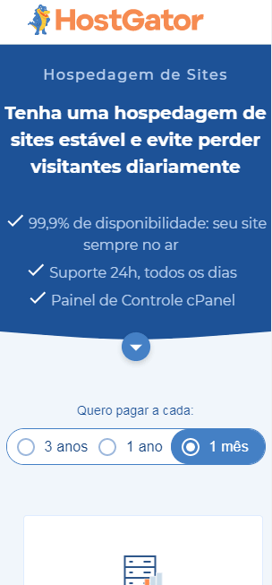

  

<h3 align="center">
  Challenge HostGator: Host plans Web page.
</h3>

  <i>Desafio HostGator: Página Web de exibição de Planos.</i>

### About
Explanations about the challenge can be found in the link below in Portuguese.
https://docs.google.com/document/d/1ueahBMI4MIegWTP0QATYt2MMhFTOyCwHaXiGclZ9jZg/edit

### How to execute

1. Clone the project on your computer via Download or Git
    - If you don't have Git installed, follow the link ``https://git-scm.com/``
2. Download Node if you have not configured it on your computer;
    - ``https://nodejs.org/en/``
    - The npm package that we will use is usually installed together with Node.
3. In the terminal or prompt(cmd), access the project root;
4. At the root of the project, run `npm i` command to download the dependencies;
    - A node_modules folder will be created at the root of the project with the dependencies downloaded.
5. Run `npm start` to run the project;
6. The project will be available at ``http://localhost:3000``, check your browser.

### Como executar (pt-br)

1. Clone o projeto em seu computador através do Download or pelo Git
    - Caso você não tenha o Git instalado, siga o link ``https://git-scm.com/``
2. Baixe o Node caso você não tenha ele configurado em seu computador;
    - ``https://nodejs.org/en/``
    - O pacote npm que iremos utilizar geralmente virá instalado juntamente com o Node.
3. No terminal ou prompt de comandos (cmd), acesse a raiz do projeto;
4. Na raiz do projeto, execute o comando `npm i` para baixar as dependências do projeto;
    - Uma pasta node_modules será criada na raiz do projeto com as dependências baixadas.
5. Execute `npm start` para executar o projeto;
6. O projeto estará disponível em ``http://localhost:3000``, verifique o seu navegador.

### Application template

#### Web version

  

#### Web mobile version

  

